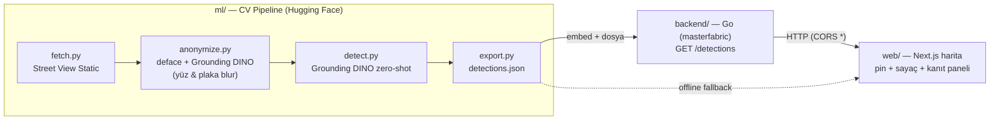

# CityLens 🏙️🔍

**Belediye için otomatik trafik levhası envanteri + eksik/devrilmiş/görünürlüğü kapalı levha aday haritası.** Google Street View sokak görüntülerinden trafik levhalarını Hugging Face görü modeliyle (Grounding DINO, zero-shot) otomatik tespit eder, KVKK uyumlu biçimde anonimleştirir ve interaktif bir harita üzerinde belediyenin varlık yönetimi & trafik güvenliği ekipleri için sunar.

> Cursor Istanbul Hackathon projesi. Tüm geliştirme Cursor IDE içinde, agentic ruleset ile yapılmıştır.

---

## 1. Problem ve Kamusal Fayda
Bir belediyede **binlerce trafik levhası** vardır; envanterleri çoğu zaman güncel değildir ve eksik, devrilmiş ya da ağaç/afiş yüzünden **görünürlüğü kapanmış** levhalar genelde ancak şikâyet/kaza sonrası fark edilir. Manuel saha taraması yavaş ve pahalıdır.

CityLens, halihazırda var olan sokak görüntülerini tarayarak:
- **Otomatik levha envanteri** çıkarır (her tespit: konum + güven skoru + anonim kanıt görseli) — GIS / saha planlaması için hazır veri.
- **Aday sorun haritası** üretir: düşük güvenli / atipik tespitler "insan doğrulaması gereken aday" (eksik/devrilmiş/görünürlüğü kapalı olabilir) olarak işaretlenir → **insan-döngüde, sorumlu AI**.
- **Veri tabanlı karar:** tahmin değil, koordinatlı gerçek tespitler; tekrarlanabilir `detections.json`.
- **KVKK:** yalnızca cansız obje; yüz/plaka, model çalışmadan önce geri döndürülemez biçimde bulanıklaştırılır.

## 2. Mimari



- **Demo-güvenliği:** `detections.json` Go binary'sine **embed** edilir → backend DB olmadan, dosya bağımlılığı olmadan, soğuk başlatmada bile `/detections` döner. Web ise backend'e kısa timeout'la bağlanır, ulaşamazsa **paketlenmiş yerel veriye** düşer → harita demo sırasında **asla boş kalmaz**.

## 3. Teknoloji Yığını
| Katman | Teknoloji | Hosting |
|---|---|---|
| Web | Next.js 14 (App Router, TS) + react-leaflet | Vercel |
| Backend | Go — **masterfabric-go** mimarisi (Chi, DDD: domain→application→infrastructure) | Render (Docker) |
| CV/AI | Hugging Face `transformers` — **Grounding DINO** (zero-shot), **deface** (anonimleştirme) | yerel/offline |
| Veri | Google Street View Static API (ücretsiz kota) | — |

## 4. Depo Yapısı
```
CityLens/
├── backend/   # Go (masterfabric-go) — detections dikey dilimi eklendi
├── web/       # Next.js harita arayüzü
├── ml/        # CV pipeline: fetch → anonymize → detect → export
├── data/      # raw/ (gitignored, KVKK), processed/detections.json
├── docs/      # KVKK-IMHA.md (imha belgesi)
└── README.md
```

Eklenen backend dikey dilimi (masterfabric konvansiyonlarına birebir uyumlu):
- `internal/domain/detection/{model,repository}`
- `internal/application/detection/{dto,usecase}`
- `internal/infrastructure/detection/json_repo.go` (embed + `DETECTIONS_PATH` override)
- `internal/infrastructure/http/handler/detection/handler.go`
- `router.go` → `GET /detections`, `GET /detections/stats` (**`/api/v1` dışında**, `/health` gibi public)

## 5. Çalıştırma (Local)

### Backend (Go)
```bash
cd backend
go run ./cmd/server
# GET http://localhost:8080/health/live      -> {"status":"alive"}
# GET http://localhost:8080/detections       -> [{lat,lng,label,score,image_url,...}]
# GET http://localhost:8080/detections/stats -> {total, by_severity, by_label, avg_score}
```
Postgres gerekmez; server DB olmadan kalkar.

### Web (Next.js)
```bash
cd web
pnpm install
# web/.env.local içine: NEXT_PUBLIC_API_URL=http://localhost:8080
pnpm dev   # http://localhost:3000
```

### CV Pipeline (Hugging Face)
```bash
cd ml
pip install -r requirements.txt   # torch + deface zaten kurulu
# .env içine GOOGLE_MAPS_API_KEY=... ekleyin
python run_pipeline.py            # fetch → anonymize → detect → export
```
Hedef nesneyi değiştirmek tek satır: `CITYLENS_TARGET` (ör. `"traffic sign"`, `"pothole"`, `"garbage bin"`) + `CITYLENS_TARGET_LABEL`.

## 6. API Sözleşmesi
`GET /detections` → `200`:
```json
[{ "id": "..", "lat": 41.0931, "lng": 28.8020, "label": "trafik levhası",
   "score": 0.94, "image_url": "/anon/0001.svg", "address": "..",
   "severity": "warning", "captured_at": "2026-06-06T08:10:00Z" }]
```

## 7. KVKK ve Etik
- Yalnızca **cansız kentsel obje**. Yüz tanıma / plaka okuma / profilleme / takip **yok**.
- Yüz & plaka, model çalışmadan **önce** geri döndürülemez biçimde bulanıklaştırılır (`fetch → anonymize → detect` zorunlu sıra; `detect.py` ham veriyi okumayı reddeder).
- Ham görüntüler gitignored, etkinlik sonunda silinir ve belgelenir → **[docs/KVKK-IMHA.md](docs/KVKK-IMHA.md)**.

## 8. AI Adaptasyonu — Cursor Kullanımı
Bu proje uçtan uca **AI-Driven** geliştirildi:

**Agentic Ruleset (zorunlu kural):**
- `.cursor/rules/citylens-hackathon.mdc` — bağlayıcı hackathon kuralları (stack, KVKK, çıktı sözleşmesi) her promptta otomatik uygulanır.
- `backend/.cursor/rules/*.mdc` — masterfabric-go'nun 10 konvansiyon dosyası (import sırası, `NewXxx`, context-first, `%w` ile hata sarma, UUID, UTC) agent tarafından birebir takip edildi.

**Prompt teknikleri & Cursor özellikleri:**
- **Kalıcı brifing dosyası** (`AI_HANDOFF.md`) → agent'a tek kaynaktan spesifikasyon.
- **Explore subagent** ile masterfabric-go mimarisi haritalandı; ardından "dikey dilim" konvansiyona uygun yazıldı.
- **Walking skeleton** yaklaşımı: önce uçtan uca çalışan en basit sürüm, sonra derinleştirme.
- **Edge-case-first**: Render `PORT` fallback, Go embed ile demo-güvenliği, web offline fallback, react-leaflet SSR/`window` sorunu önceden çözüldü.

**Bonus — Cursor CLI & SDK:**
- `tools/cursor/summarize_detections.mjs` — Cursor **SDK** (`@cursor/sdk`) ile `detections.json`'dan yönetici özeti üreten örnek otomasyon.
- Cursor **CLI** (`cursor-agent`) ile tekrarlanabilir görev çalıştırma; ayrıntı: [`tools/cursor/README.md`](tools/cursor/README.md).

## 9. Deploy
**Backend → Render** (Docker): repo'da `render.yaml` mevcut. Render → New → Blueprint → repo seç. `rootDir: backend`, Dockerfile `golang:1.25-alpine` (go.mod 1.25.x ile uyumlu). Health check: `/health/live`. Render `PORT`'u inject eder, config otomatik okur.

**Web → Vercel:** New Project → repo → **Root Directory = `web`**. Env: `NEXT_PUBLIC_API_URL = https://<render-app>.onrender.com`. Framework otomatik (Next.js).

Adım adım kontrol listesi: [`docs/DEPLOY.md`](docs/DEPLOY.md).

## 10. Tekrarlanabilirlik (ödül şartı)
- Sonuçlar `data/processed/detections.json` + commit geçmişi ile tekrarlanabilir.
- Demo canlı model çıkarımına bağımlı değildir (embed edilmiş JSON).

## 11. Takım
- _(isim/rol — doldurun)_

---
_Geleceği sadece beklemiyoruz; onu birlikte inşa ediyoruz._ 🚀
