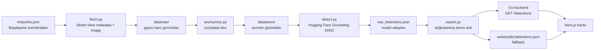

# CityLens

CityLens, Google Street View görüntülerinden cansız kentsel objeleri tespit eden, yüz ve plaka mahremiyetini koruyan, sonuçları canlı harita üzerinde belediye saha ekipleri için görünür hale getiren AI destekli kentsel denetim prototipidir.

Bu repo, **Cursor Hackathon: AI-Driven Kentsel Çözümler** teknik, etik ve operasyonel isterlerine göre hazırlanmıştır. Teslim kapsamı; Next.js web arayüzü, Go tabanlı masterfabric-go mimarisiyle backend, Hugging Face bilgisayarlı görü pipeline'ı, Google Street View veri kaynağı, Vercel/Render canlı demo düzeni, Cursor IDE/ruleset kullanımı, Cursor CLI/SDK bonus entegrasyonu ve KVKK veri imha belgesini içerir.

## Proje Özeti

Belediyeler için tabela, reklam panosu, atık noktası ve benzeri kentsel objelerin güncel durumunu takip etmek manuel saha gezileriyle maliyetli ve yavaştır. CityLens bu süreci veri odaklı hale getirir:

- Başakşehir çevresindeki seçili koordinatları Google Street View Static API ile tarar.
- Ham görüntüleri model çalışmadan önce anonimleştirme adımından geçirir.
- Hugging Face Grounding DINO ile yalnızca cansız kentsel obje adaylarını çıkarır.
- Yanlış veya kararsız çıktıları public demo setinden eleyerek doğrulanmış kanıtları bırakır.
- Konum, kategori, skor, adres ve anonim kanıt görselini canlı haritada gösterir.
- Backend ulaşılamazsa web tarafında paketlenmiş `detections.json` fallback'i ile demo boş kalmaz.

Final canlı demo setinde 5 doğrulanmış kanıt kaydı vardır: 2 çöp/atık, 2 reklam panosu, 1 kent levhası. Bu küçük ama temiz set, demo sırasında yanlış pozitifleri göstermek yerine modelin güvenilir çıktısını savunmak için bilinçli olarak seçilmiştir.

## Hackathon İsterleri

| İster | CityLens karşılığı |
|---|---|
| Web: Next.js | `web/` altında Next.js 14, TypeScript ve React Leaflet harita arayüzü |
| Mobil: Expo | Bu teslimde canlı demo web odaklıdır; `/detections` JSON sözleşmesi Expo istemcisi tarafından doğrudan tüketilebilir yapıdadır |
| Backend: Go | `backend/` altında Go, Chi router ve masterfabric-go DDD katman düzeni |
| masterfabric-go mimarisi | Domain, application, infrastructure, handler, repository ve usecase ayrımı korunmuştur |
| AI veri seti/model | `ml/` pipeline'ında Hugging Face `transformers` ve Grounding DINO zero-shot detection |
| Harici veri kaynağı | Google Street View Static API, metadata kontrolü ve kota dostu indirme akışı |
| Hosting | Web Vercel, backend Render Docker dağıtımı için hazırlanmıştır |
| Cursor IDE | Geliştirme Cursor IDE ve agentic çalışma akışıyla yürütülmüştür |
| Agentic ruleset | `.cursor/rules/citylens-hackathon.mdc` ve `backend/.cursor/rules/*.mdc` dosyaları mevcut |
| Sürekli commit | Geliştirme süreci anlamlı Git commit'leriyle izlenebilir durumdadır |
| Cursor CLI/SDK bonusu | `tools/cursor/` altında Cursor SDK ve `cursor-agent` kullanım dokümantasyonu vardır |
| KVKK ve etik | `docs/KVKK-IMHA.md` ile anonimleştirme, veri minimizasyonu ve ham veri imhası belgelenmiştir |
| Canlı demo | Web harita + Render backend + local fallback ile çalışabilir demo düzeni kuruludur |
| Tekrarlanabilir sonuç | `detections.json` çıktıları backend'e embed edilir ve web fallback olarak paketlenir |
| Çalıştırılabilir kaynak kod | Backend, web ve ML pipeline komutları aşağıda belgelenmiştir |

## Değerlendirme Kriterlerine Eşleme

| Kriter | Puan | CityLens kanıtı |
|---|---:|---|
| Teknik çalışırlık | 30 | Go backend public `/detections` endpoint'i, Next.js harita, Render/Vercel dağıtım düzeni, offline fallback, build/test doğrulaması |
| Doğruluk ve güvenilirlik | 25 | 52 ham Street View görüntüsünden anonimleştirme ve model sonrası kalite kontrol; public demo setinde yalnızca doğrulanmış 5 kanıt |
| Kamu faydasına uygunluk | 20 | Belediye saha ekipleri için koordinatlı, kanıtlı ve filtrelenebilir kentsel denetim ekranı |
| AI adaptasyonu | 10 | Cursor IDE, agentic ruleset, Hugging Face modeli, Cursor SDK/CLI bonus klasörü, AI kullanım dokümantasyonu |
| KVKK ve etik uyum | 10 | Yüz/plaka tanıma yok, takip/profilleme yok, anonimleştirme önce, ham veri imhası belgeli |
| Sunum ve dokümantasyon | 5 | README, deploy rehberi, KVKK belgesi, Cursor araç dokümantasyonu ve tekrarlanabilir komutlar |

Eşitlik durumunda teknik çalışırlık belirleyici olduğu için demo, canlı model çıkarımına bağımlı değildir. Model çıktıları önceden doğrulanmış JSON olarak servis edilir; bu sayede ağ, GPU veya model indirme gecikmesi jüride canlı demoyu bozmaz.

## Mimari



Demo sırasında görüntüler canlı olarak internetten çekilmez. Google Street View Static API, ML pipeline aşamasında kullanılır. Ürün ekranı, doğrulanmış ve anonimleştirilmiş kanıt görsellerini `web/public/anon/` altından ve tespit verisini `/detections` sözleşmesiyle gösterir.

## Veri ve KVKK

CityLens yalnızca cansız kentsel objeleri hedefler:

- Kent/trafik levhası
- Reklam panosu
- Çöp/atık noktası

Kesin olarak yapılmayanlar:

- Yüz tanıma veya kimlik tespiti
- Plaka okuma veya araç sahibi çıkarımı
- Kişi ya da araç takibi
- Davranış analizi veya profilleme

Pipeline sırası bağlayıcıdır:

```text
fetch -> anonymize -> detect -> export
```

Bu sıra sayesinde model, ham görüntü yerine anonimleştirilmiş görüntü üzerinde çalışır. Ham Street View görüntüleri git'e, public klasöre veya açık bulut depolamaya konmaz. Hackathon teslimi için ham görüntüler silinmiş ve imha kaydı [docs/KVKK-IMHA.md](docs/KVKK-IMHA.md) içinde belgelenmiştir.

## AI ve Cursor Kullanımı

Hackathon metni, sadece ürün çıktısını değil geliştirme sürecinin AI-driven olmasını da puanlıyor. CityLens'te bu gereksinim şu şekilde karşılandı:

- **Cursor IDE:** Repo okuma, mimari kararları takip etme, frontend/backend entegrasyonu, test hatalarını analiz etme ve dokümantasyon düzenleme için aktif kullanıldı.
- **Agentic ruleset:** `.cursor/rules/citylens-hackathon.mdc` dosyası stack, KVKK, hosting, demo ve Cursor bonus kurallarını bağlayıcı proje kuralı haline getirir.
- **Backend ruleset:** `backend/.cursor/rules/*.mdc` dosyaları masterfabric-go katmanlama, naming, error handling, usecase ve handler kurallarını sabitler.
- **Prompt teknikleri:** Repo-guided geliştirme, küçük dikey dilimlerle ilerleme, önce doğrulama sonra refactor, KVKK kırmızı çizgilerini prompt kısıtı olarak verme ve demo risklerini test çıktılarıyla kapatma yaklaşımı kullanıldı.
- **Hugging Face AI modeli:** Grounding DINO zero-shot detection ile tabela, reklam panosu ve atık gibi kentsel obje adayları üretildi.
- **Cursor SDK/CLI bonusu:** `tools/cursor/` klasörü, tespit JSON'undan belediye odaklı özet üretmek için Cursor SDK ve terminal otomasyonu için `cursor-agent` kullanımını belgeler.

Cursor SDK örneği:

```bash
cd tools/cursor
pnpm install
set CURSOR_API_KEY=cursor_...
pnpm summarize
```

Cursor CLI örneği:

```bash
cursor-agent -p "data/processed/detections.json'u oku; belediye saha ekibi için en öncelikli 3 noktayı özetle."
```

Bu araçlar canlı demo için zorunlu değildir; AI adaptasyonu ve otomasyon kabiliyetini belgeleyen bonus katmandır.

## Repo Yapısı

```text
CityLens/
  backend/                 Go backend, masterfabric-go tabanlı mimari
  web/                     Next.js harita arayüzü
  ml/                      Street View fetch, anonimleştirme, detection ve export pipeline
  data/processed/          tekrarlanabilir detection çıktıları
  web/public/anon/         public demo için seçilmiş anonim kanıt görselleri
  docs/KVKK-IMHA.md        anonimleştirme ve ham veri imha belgesi
  docs/DEPLOY.md           Vercel ve Render canlıya alma rehberi
  tools/cursor/            Cursor SDK ve Cursor CLI bonus dokümantasyonu
```

## API Sözleşmesi

`GET /detections`

```json
[
  {
    "id": "uuid",
    "lat": 41.075235,
    "lng": 28.802693,
    "label": "Çöp / atık",
    "category": "garbage",
    "score": 0.6151,
    "image_url": "/anon/0006.jpg",
    "address": "Ziya Gökalp Mah., Başakşehir/İstanbul",
    "severity": "info",
    "captured_at": "2026-06-06T12:18:00Z"
  }
]
```

`GET /detections/stats`

```json
{
  "total": 5,
  "by_label": {
    "Çöp / atık": 2,
    "Reklam panosu": 2,
    "Kent levhası": 1
  }
}
```

## Local Çalıştırma

Backend:

```bash
cd backend
go run ./cmd/server
```

Backend kontrol:

```bash
curl http://localhost:8080/health/live
curl http://localhost:8080/detections
curl http://localhost:8080/detections/stats
```

Web:

```bash
cd web
pnpm install
pnpm dev
```

`web/.env.local`:

```env
NEXT_PUBLIC_API_URL=http://localhost:8080
```

ML pipeline:

```bash
cd ml
pip install -r requirements.txt
python run_pipeline.py
```

Pipeline tekrar çalıştırılırsa Google Street View API anahtarı gerekir ve ham görüntüler yeniden indirilebilir. Teslim öncesinde KVKK gereği ham görüntülerin tekrar silinmesi ve `docs/KVKK-IMHA.md` kaydının güncellenmesi gerekir.

## Deploy

Backend Render:

- `render.yaml` hazırdır.
- Root directory: `backend`
- Runtime: Docker
- Health check: `/health/live`
- Render `PORT` değişkeni otomatik okunur.

Web Vercel:

- Root directory: `web`
- Environment variable: `NEXT_PUBLIC_API_URL=https://<render-backend-url>`
- Backend soğuk başlasa veya geçici ulaşılamasa bile web local fallback veriyle açılır.

Ayrıntılı canlıya alma rehberi: [docs/DEPLOY.md](docs/DEPLOY.md)

## Doğrulama Komutları

Backend:

```bash
cd backend
go test ./...
```

Web:

```bash
cd web
pnpm build
pnpm exec tsc --noEmit
```

Geliştirme geçmişi Git commit log'u üzerinden izlenebilir. Son commit örnekleri:

```text
db3c668 Update demo detections, README, and tenant context
4f5df7d Mini photo deletion2
4d2ea21 Mini photo deletion
175916c Update detections and add anonymized images
a59f7c7 Add multi-category detection & anonymize tweaks
```

## Ödül Hakediş Şartları

| Şart | Durum |
|---|---|
| Canlı demo | Web harita, Go backend ve fallback veriyle hazır |
| Tekrarlanabilir sonuç | `detections.json` ve public anonim kanıt görselleri repo içinde |
| Çalıştırılabilir kaynak kod | Backend, web ve ML komutları belgeli |
| KVKK veri silme/anonimleştirme belgesi | [docs/KVKK-IMHA.md](docs/KVKK-IMHA.md) hazır |

## Takım

Burhan Çalık - fikir, frontend, backend, CV pipeline, canlı demo hazırlığı ve dokümantasyon.
