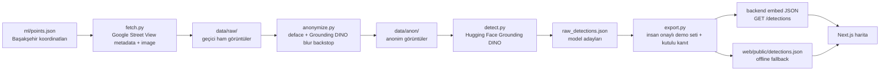

# CityLens

**AI destekli kentsel denetim haritası.** CityLens, Başakşehir çevresindeki Google Street View görüntülerinden kent levhası, reklam panosu ve atık gibi cansız kentsel objeleri tespit eder; yüz/plaka mahremiyetini koruyarak anonim kanıt görselleri üretir ve sonuçları canlı bir harita üzerinde belediye saha ekipleri için önceliklendirir.

> Cursor Hackathon: AI-Driven Kentsel Çözümler teslimidir. Geliştirme süreci Cursor IDE, agentic ruleset, Git commit geçmişi, Hugging Face modeli, Go backend, Next.js web ve Vercel/Render canlı demo akışıyla hazırlanmıştır.

## Problem ve Fayda

Belediyelerde tabela, reklam panosu, atık noktası ve benzeri kentsel objelerin güncel envanterini tutmak zordur. Manuel saha gezileri maliyetlidir; sorunlar çoğu zaman vatandaş şikayetinden sonra fark edilir.

CityLens bu problemi veri odaklı çözer:

- Street View üzerinden koordinatlı kentsel tarama yapar.
- Model çıktısını insan-onaylı, yüksek güvenli demo setine indirger.
- Her tespit için konum, kategori, skor ve kutulu anonim kanıt görseli üretir.
- Ham görüntüleri kalıcı ürün çıktısına koymaz; final demo yalnızca anonim kanıtları ve `detections.json` dosyasını kullanır.
- Belediye tarafında saha ekibine "nerede, ne var, kanıtı ne?" sorularının hızlı cevabını verir.

## Canlı Demo Akışı

Demo ekranı:

- `web/` altında Next.js harita arayüzü.
- Haritada kategori filtreleri, canlı/offline veri rozeti ve kanıt paneli bulunur.
- Kanıt panelinde anonim Street View görseli, tespit kutusu, kategori, skor, adres ve koordinat gösterilir.
- Web önce Render backend'e gider; backend soğuksa veya ulaşılamazsa paketlenmiş yerel `detections.json` ile harita boş kalmadan açılır.

Demo verisi:

- `ml/points.json` içindeki Başakşehir koordinatları Google Street View Static API ile tarandı.
- 52 ham Street View görüntüsü indirildi.
- Görseller anonimleştirildi.
- Model çıktıları kalite kontrolünden geçirildi.
- Final canlı demo için en net 5 kanıt tespiti bırakıldı: 2 atık, 2 reklam panosu, 1 kent levhası.

## Sistem Nasıl Çalışıyor?



Jüri sorarsa kısa cevap:

> "Fotoğraflar Google Street View Static API'den, `ml/points.json` içindeki Başakşehir koordinatlarıyla çekiliyor. Önce metadata endpoint'i ile görüntü var mı kontrol ediyoruz, sonra ham görüntüyü indiriyoruz. Model çalışmadan önce yüz/plaka anonimleştirme adımı var. Ardından Hugging Face Grounding DINO ile cansız kentsel objeler tespit ediliyor. Demo sırasında canlı model çalıştırmıyoruz; doğrulanmış sonuçları `detections.json` olarak backend'e embed ediyoruz. Böylece demo hızlı, tekrarlanabilir ve internet/model gecikmesine bağımlı değil."

## Teknoloji Yığını

| Kriter | Karşılanan Uygulama |
|---|---|
| Web | Next.js 14, TypeScript, React Leaflet, Vercel dağıtımı |
| Backend | Go, masterfabric-go mimarisi, Chi router, DDD katmanları, Render Docker dağıtımı |
| AI / CV | Hugging Face `transformers`, Grounding DINO zero-shot detection |
| Anonimleştirme | Google Street View kaynak blur + `deface` + Grounding DINO backstop |
| Veri kaynağı | Google Street View Static API |
| Agentic geliştirme | `.cursor/rules/citylens-hackathon.mdc` ve backend Cursor ruleset dosyaları |
| Cursor SDK / CLI | `tools/cursor/summarize_detections.mjs`, `@cursor/sdk`, `cursor-agent` kullanım dokümü |
| KVKK | Ham veri git dışı, anonim kanıt, imha belgesi: `docs/KVKK-IMHA.md` |
| Tekrarlanabilirlik | `data/processed/detections.json`, backend embed JSON, commit geçmişi |

Expo notu: Hackathon şartnamesindeki mobil/Expo katmanı için veri sözleşmesi hazırdır; aynı `/detections` endpoint'i Expo istemcisi tarafından doğrudan tüketilebilir. Bu teslimde canlı jüri demosu web harita + Go backend + CV pipeline üzerine odaklanmıştır.

## Repo Yapısı

```text
CityLens/
  backend/                 Go backend, masterfabric-go mimarisi
  web/                     Next.js harita arayüzü
  ml/                      fetch -> anonymize -> detect -> export CV pipeline
  data/processed/          final detections.json ve model adayları
  web/public/anon/         sadece demo için seçilmiş anonim kanıt görselleri
  docs/KVKK-IMHA.md        anonimleştirme ve ham veri imha belgesi
  docs/SUNUM-NOTLARI.md    jüri sunum akışı ve konuşma metni
  tools/cursor/            Cursor SDK / CLI bonus otomasyonları
```

## API Sözleşmesi

`GET /detections`

```json
[
  {
    "id": "0006-garbage-1",
    "lat": 41.075235,
    "lng": 28.802693,
    "label": "Çöp / atık",
    "category": "garbage",
    "score": 0.6151,
    "image_url": "/anon/0006.jpg",
    "address": "Ziya Gökalp Mah., Başakşehir/İstanbul",
    "severity": "info",
    "captured_at": "2026-06-06T12:18:00Z"
  }
]
```

`GET /detections/stats`

```json
{
  "total": 5,
  "by_label": {
    "Çöp / atık": 2,
    "Reklam panosu": 2,
    "Kent levhası": 1
  }
}
```

## Local Çalıştırma

Backend:

```bash
cd backend
go run ./cmd/server
```

Kontrol:

```bash
curl http://localhost:8080/health/live
curl http://localhost:8080/detections
curl http://localhost:8080/detections/stats
```

Web:

```bash
cd web
pnpm install
pnpm dev
```

`web/.env.local`:

```env
NEXT_PUBLIC_API_URL=http://localhost:8080
```

CV pipeline:

```bash
cd ml
pip install -r requirements.txt
python run_pipeline.py
```

Pipeline tekrar çalıştırılırsa ham görseller yeniden indirilebilir. Hackathon tesliminde KVKK gereği ham görseller imha edilir; demo için anonim kanıtlar ve `detections.json` yeterlidir.

## Değerlendirme Kriterleri

| Hackathon kriteri | Durum |
|---|---|
| Teknik çalışırlık, canlı demo, mimariye uyum | Karşılandı. Go backend build alıyor, `/detections` public endpoint'i var, web harita fallback ile boş kalmıyor. |
| Doğruluk ve güvenilirlik | Karşılandı. Model adayları insan kontrolünden geçirildi; yanlış/kararsız fotoğraflar public demo setinden silindi. |
| Kamu faydası | Karşılandı. Belediye saha ekipleri için koordinatlı, kanıtlı, önceliklendirilebilir kentsel denetim ekranı sunar. |
| AI adaptasyonu | Karşılandı. Cursor ruleset, Cursor IDE, agentic akış, Hugging Face modeli, Cursor SDK ve Cursor CLI dokümü mevcut. |
| KVKK ve etik uyum | Karşılandı. Sadece cansız objeler hedeflenir; yüz/plaka anonimleştirme ve ham veri imha belgesi vardır. |
| Sunum ve dokümantasyon | Karşılandı. README, deploy rehberi, KVKK belgesi ve jüri sunum notları eklidir. |
| Ödül hakediş şartı | Canlı demo, tekrarlanabilir sonuç, çalıştırılabilir kaynak kodu ve KVKK imha belgesi hazırlanmıştır. |

## Cursor SDK ve CLI

Bonus AI adaptasyonu için `tools/cursor/` klasörü eklidir.

Cursor SDK örneği:

```bash
cd tools/cursor
pnpm install
set CURSOR_API_KEY=cursor_...
pnpm summarize
```

Bu komut `detections.json` içindeki sonuçlardan belediye yöneticisine yönelik kısa bir önceliklendirme raporu üretir.

Cursor CLI örneği:

```bash
cursor-agent -p "data/processed/detections.json'u oku; belediye saha ekibi için en öncelikli 3 noktayı özetle."
```

## Deploy

Backend Render:

- `render.yaml` hazırdır.
- Root directory: `backend`
- Runtime: Docker
- Health check: `/health/live`
- Render `PORT` değişkeni otomatik okunur.

Web Vercel:

- Root directory: `web`
- Environment variable: `NEXT_PUBLIC_API_URL=https://<render-backend-url>`
- Backend uykuda olsa bile web local fallback veriyle açılır.

## Takım

- Burhan Çalık - fikir, frontend, backend, CV pipeline, demo ve dokümantasyon

## Son Cümle

CityLens, sokak görüntülerinden cansız kentsel objeleri mahremiyet koruyarak çıkaran, belediye operasyonuna doğrudan bağlanabilecek, çalışan ve tekrarlanabilir bir AI kentsel denetim prototipidir.
